  

  

 

## 👋 About me

- 🎓 CS student at **San Francisco State University**, based in the SF Bay Area
- 🔨 I like small, sharp tools over big vague ideas — build fast, test on real users, kill what doesn't work
- 🎬 Currently building [**autobroll**](https://github.com/andriidrok1/autobroll) — AI short-form video editor in the browser (captions, b-roll, silence cuts) on Remotion
- 📈 Deep into markets: Pine Script v6 indicators, backtesting, on-chain data analysis
- 🌐 Portfolio: [andriidrok.com](https://andriidrok.com)

 

## 🛠️ Tech stack

 

## 🚀 Featured projects

| Project | What it does | Stack |
|---|---|---|
| 🎬 [**autobroll**](https://github.com/andriidrok1/autobroll) | AI short-form video editor in the browser: auto captions with accents, drag/retiming editor, b-roll placement — transcript in, rendered video out | TypeScript, Remotion, React |
| 📊 [**strategy-checker**](https://github.com/andriidrok1/strategy-checker) | Describe a trading strategy in plain English → real backtest with statistical validation. Exposes curve-fitting, not alpha | Python |
| 🧠 [**compound**](https://github.com/andriidrok1/compound) | Autonomous research agent for your second brain — built solo at Nozomio Hackathon (EF SF) | TypeScript, Convex |
| ✨ [**andriidrok.com**](https://andriidrok.com) | Particle-morph portfolio — thousands of particles reshaping between scenes | Three.js, WebGL |

 

## 📈 Stats

  

  

 

## 🐍 Contribution snake

<picture>
  <source media="(prefers-color-scheme: dark)" srcset="https://raw.githubusercontent.com/andriidrok1/andriidrok1/output/github-contribution-grid-snake-dark.svg"/>
  <source media="(prefers-color-scheme: light)" srcset="https://raw.githubusercontent.com/andriidrok1/andriidrok1/output/github-contribution-grid-snake.svg"/>
  
</picture>

 

