[andriidrok.com](https://andriidrok.com) &nbsp;·&nbsp; [email](mailto:clb@mirasvit.com)

### about

CS student at San Francisco State, based in the SF Bay Area. I like small, sharp
tools over big vague ideas — build fast, test on real users, kill what doesn't work.

Right now I'm building [autobroll](https://github.com/andriidrok1/autobroll), an AI
short-form video editor that runs in the browser. Also deep into markets: Pine
Script indicators, backtesting, on-chain data.

### stack

`python` `typescript` `javascript` `react` `node` `three.js` `fastapi` `postgres` `docker` `git` `linux` `bash`

### projects

[`autobroll`](https://github.com/andriidrok1/autobroll) — AI short-form video editor
in the browser. Auto captions with accents, drag-and-retime editing, b-roll
placement: transcript in, rendered video out.

[`strategy-checker`](https://github.com/andriidrok1/strategy-checker) — Describe a
trading strategy in plain English, get a real backtest with statistical validation.
Exposes curve-fitting, not alpha.

[`compound`](https://github.com/andriidrok1/compound) — Autonomous research agent
for your second brain. Built solo at Nozomio Hackathon, EF SF.

[`andriidrok.com`](https://andriidrok.com) — Particle-morph portfolio: thousands of
particles reshaping between scenes, in Three.js and WebGL.

### stats

### about this page

Every graphic here is generated, not embedded from anyone else's server.
`ascii.svg` is a photo pushed through a character ramp; the four stat graphics are
drawn straight from the GitHub GraphQL API by
[a scheduled action](.github/workflows/stats.yml) that runs once a day and only
commits what actually changed. They animate with SMIL inside the SVG, because
GitHub strips scripts from READMEs — and since nothing loads from a third party,
nothing here can rate-limit or go dark.

Language totals cover public repositories only. `year.svg` uses the same character
ramp as the portrait: `:` `+` `#` `@`, quiet to loud.
